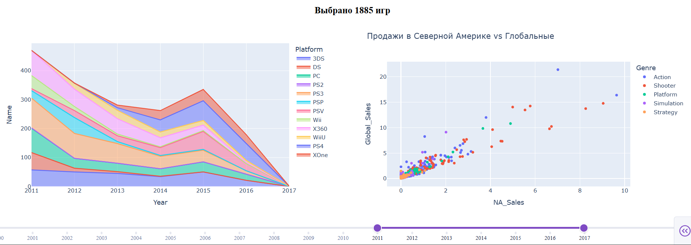

# Video Games Market Analysis

## 📊 Project Overview

This project analyzes video game sales and review data to identify trends in the video game market.

An interactive dashboard was developed using **Python, Dash and Plotly**, allowing users to explore the data by genre, rating and release period.

---

## 🎯 Business Questions

The analysis focuses on questions such as:

- How did the number of released games change over time?
- Which platforms were most active during different periods?
- How are critic and user scores related?
- How does the market differ across genres?
- How do different ratings and release periods affect the results?

---

## 📈 Interactive Dashboard

The dashboard provides interactive filters for:

- **Genre**
- **Rating**
- **Release year**

The visualizations include:

- Game releases by platform and year
- Relationship between critic and user scores
- Number of games matching the selected filters

---

## 🔎 Analysis Workflow

1. Data loading
2. Data cleaning and preprocessing
3. Handling missing values
4. Filtering the relevant time period
5. Exploratory data analysis
6. Interactive visualization
7. Dashboard development

---

## 💡 Key Insights

The analysis allows users to identify changes in the video game market over time and compare different platforms, genres and ratings.

The relationship between critic and user scores can also be explored interactively, helping identify differences between professional and user evaluations.

---

## 🛠️ Technologies

- Python
- Pandas
- Plotly
- Dash
- Jupyter Notebook

---

## 📁 Project Structure

```text
video-games-market-analysis/
│
├── game_git.ipynb
├── games_market_dash.py
└── README.md
